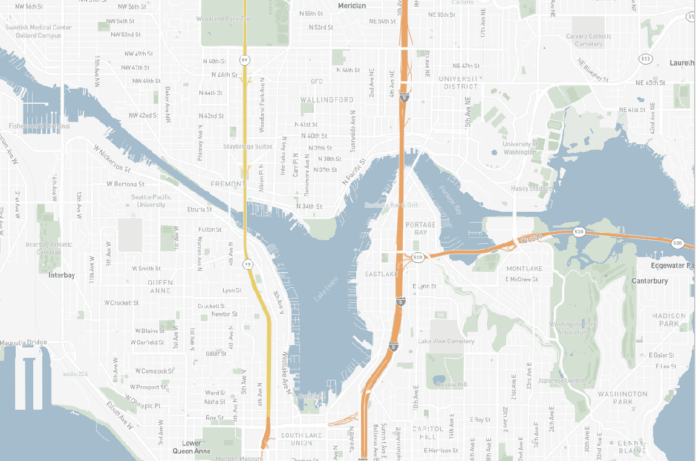
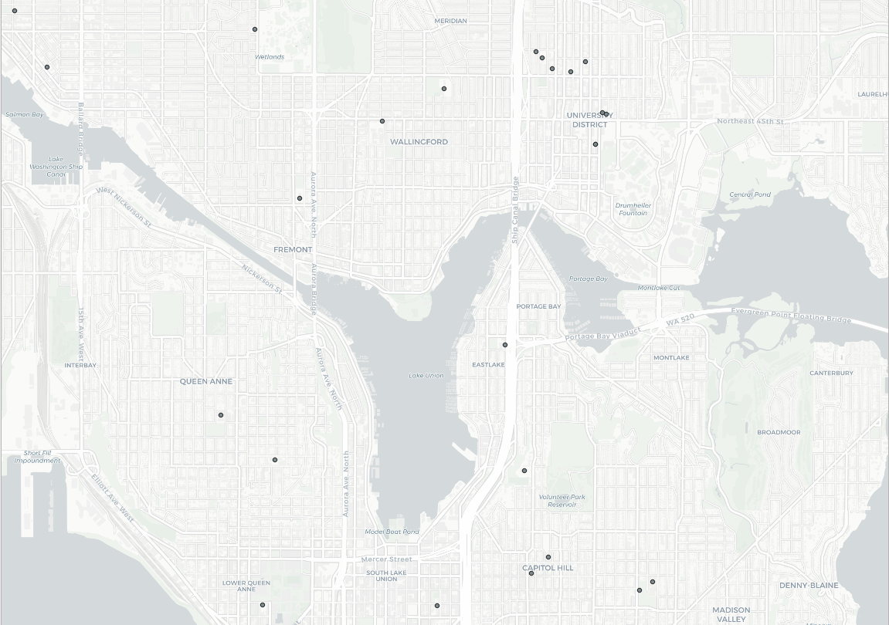
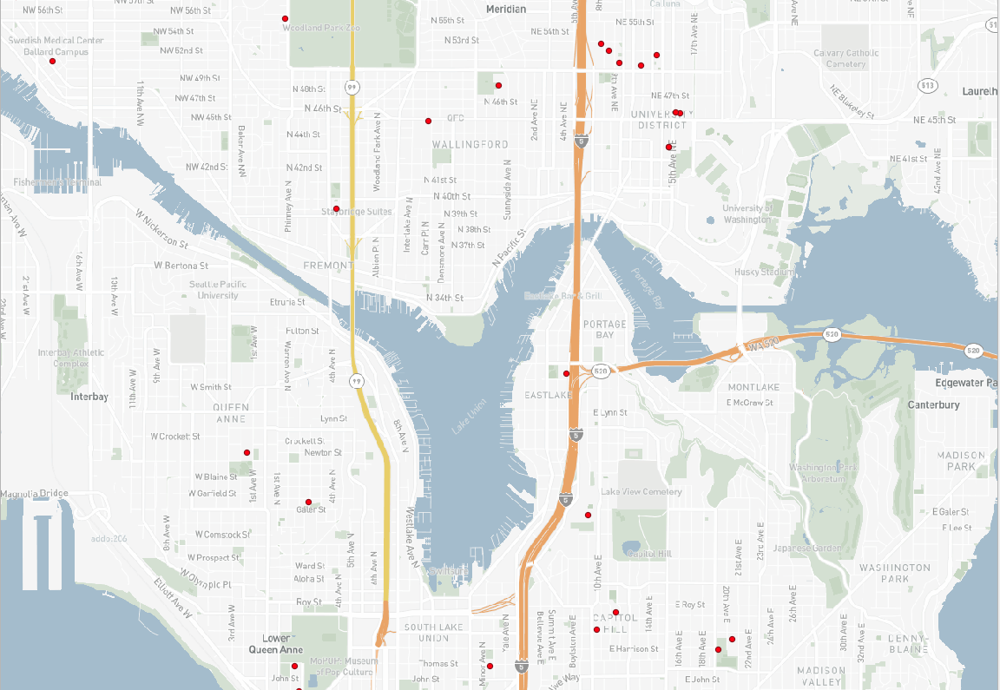
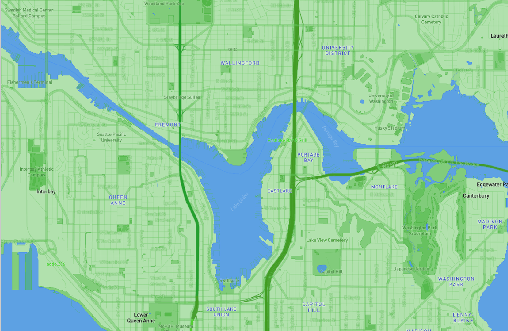

# Lab4

[Interactive Web Map](https://hersheylande.github.io/Lab4/)

## Tile 1

- This tile is a modified basemap simplified highlighting parkland through labels and major roadways/highways in the Seattle by using the orange color. A light blue color is added to highlight and easy identify bodies of water
- Geographic Area of Focus: Seattle, WA
- Zoom Levels: Max Zoom - 12; Min Zoom - 8

## Tile 2

- This tile includes data layer shows the different locations around Seattle that have provided additional food and housing shelters due to the COVID-19 Pandemic
- Geographic Area of Focus: Seattle, WA
- Zoom Levels: Max Zoom - 12; Min Zoom - 8

## Tile 3

- This tile is utilizing the modified basemap from Tile 1 & the map data from Tile 2
- Geographic Area of Focus: Seattle, WA
- Zoom Levels: Max Zoom - 12; Min Zoom - 8

## Tile 4

- This tile is made using the color scheme from the Seattle Seahawks american football team.
- Geographic Area of Focus: Seattle, WA
- Zoom Levels: Max Zoom - 12; Min Zoom - 8
